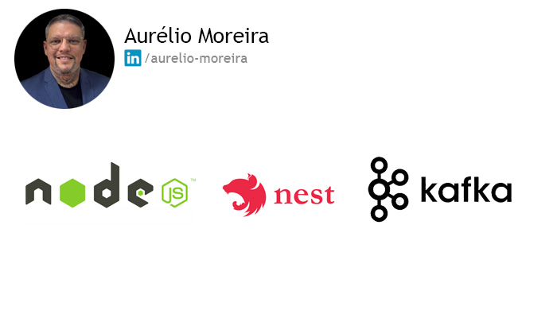

# MS Mail sender 

<!-- 


 -->



> "O projeto visa demonstrar um microserviço de envio de emails usando Kafka. Nele, as mensagens processadas em lote. O Kafka age como intermediário, garantindo escalabilidade, eficiência e alta disponibilidade no fluxo de emails..

### Ajustes e melhorias

O projeto ainda está em desenvolvimento e as próximas atualizações serão voltadas nas seguintes tarefas:

- [x] Envio de e-mail
- [x] Comunicação com Kafka
- [x] Teste unitarios
- [ ] Teste integração
- [ ] Teste e2e
- [ ] Gerenciamento de templates
- [ ] Restringir acesso via token
- [ ] Política de retentativas

## 💻 Pré-requisitos

Antes de começar, verifique se você atendeu aos seguintes requisitos:

1. **NestJS**: versão 9.0.0 ou superior.
2. **TypeScript**: versão 4.7.4 ou superior.
3. **Node.js**: versão compatível com as dependências listadas.
   
<!-- * Você leu `<guia / link / documentação_relacionada_ao_projeto>`. -->

## 🚀 Instalando 

```
docker-compose up -d
```

## ☕ Usando 

Para usar basta alimentar o kafka com um topico chamado email e enviar o seguinte documento:

```
{
	"to": "to@email.com",
	"toName": "Name",
	"from": "from@email.com",
	"fromName": "Name",
	"subject": "Subject",
	"html": "<h2>HTML</h2>"
}
```
Para usar outro nome para fila você deve alterar o controller. Não se esqueça de preencher as variaveis de ambiente referente ao smtp:

```
SMTP_HOST=
SMTP_PORT=
SMTP_USER=
SMTP_PASS=
```
## 📫 Contribuindo para

Para contribuir, siga estas etapas:

1. Bifurque este repositório.
2. Crie um branch: `git checkout -b <nome_branch>`.
3. Faça suas alterações e confirme-as: `git commit -m '<mensagem_commit>'`
4. Envie para o branch original: `git push origin <nome_do_projeto> / <local>`
5. Crie a solicitação de pull.

Como alternativa, consulte a documentação do GitHub em [como criar uma solicitação pull](https://help.github.com/en/github/collaborating-with-issues-and-pull-requests/creating-a-pull-request).

<!-- ## 🤝 Colaboradores

Agradecemos às seguintes pessoas que contribuíram para este projeto:

<table>
  <tr>
    <td align="center">
      <a href="#">
        <br>
        <sub>
          <b>Iuri Silva</b>
        </sub>
      </a>
    </td>
    <td align="center">
      <a href="#">
        <br>
        <sub>
          <b>Mark Zuckerberg</b>
        </sub>
      </a>
    </td>
    <td align="center">
      <a href="#">
        <br>
        <sub>
          <b>Steve Jobs</b>
        </sub>
      </a>
    </td>
  </tr>
</table> -->
<!-- 
## 😄 Seja um dos contribuidores

Quer fazer parte desse projeto? Clique [AQUI](CONTRIBUTING.md) e leia como contribuir. -->

<!-- ## 📝 Licença

Esse projeto está sob licença. Veja o arquivo [LICENÇA](LICENSE.md) para mais detalhes. -->